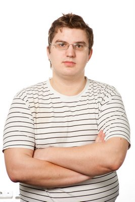

# Fprog Spb

15 апреля 2015 (среда), 19:00 

Встреча инженеров интересующихся функциональным программированием (clojure, erlang, haskell, scala)

Регистрация - https://spb-fp-meetup.timepad.ru/event/195465/ (обязательна)

В этот раз встреча будет посвящена языку Scala:

## «Scala Implicits под капотом».

### Александр Подхалюзин

Implicit conversions и implicit parameters очень важная и уникальная
часть Scala, к тому же крайне мощная. Чтобы использовать всю эту мощь,
нужно разобраться как компилятор ищет их. В данной лекции мы полностью
покроем эту тему, а также рассмотрим, как IntelliJ IDEA может помочь с
Implicits. Также мы освоим довольно хорошо известный Magnet pattern.

Саша закончил матмех, ведет в СПбАУ РАН курс по программированию на
Scala. Руководит командой, отвечающей за поддержку Scala в IntelliJ
IDEA.

## Scalan

## Дмитрий Бушев

Дмитрий раскажет про framework [Scalan](https://github.com/scalan/scalan-ce), разработкой которого он занимаеться.

Scalan is a framework for creating staged embedded DSLs in Scala. It allows you to write high-level Scala programs and compile them to efficient low-level code (in the language determined by the used backend) and to develop new abstractions which can be used in such programs.

## ScalaCheck

### Петр Громов 

расскажет про то, как он использует ScalaCheck для
проверки тонких мест в идее, конкретно в подсистеме индексации.

Петр закончил матмех, один из ведущих разработчиков платформы IntelliJ .
